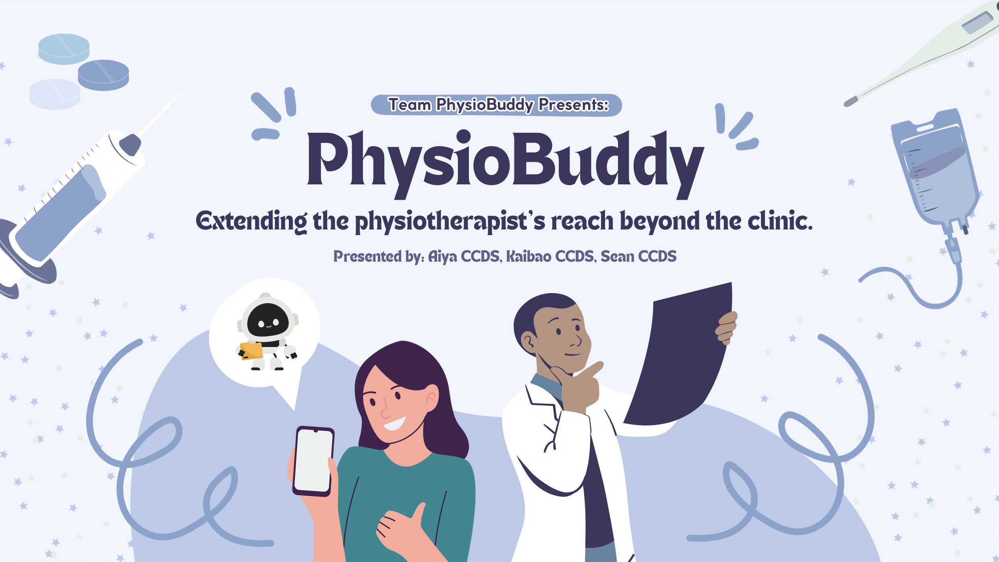

# PhysioBuddy

**AI-Powered Physiotherapy Companion for Enhanced Recovery**

PhysioBuddy is an innovative mobile application that revolutionizes physiotherapy by combining AI-powered pose estimation, intelligent chatbot assistance, and comprehensive patient management to deliver personalized rehabilitation experiences.

<p align='center'>
  
</p>

<p align="center">
    <a href="https://github.com/Naees/PhysioBuddy/tree/Production/Physiobuddy">React Native Frontend</a>
    |
    <a href="https://github.com/Naees/PhysioBuddy/tree/Production/backend">Python Flask Backend</a>
    |
    <a href="">Demo Video</a>
</p>

## Awards & Recognition
- 1st Place GenAI Augmentation Challenge 2025 


## Meet the team 
<p align='center'>
  
</p>
 
1.  Kaibao (Nanyang Technological University, Computer Science Undergraduate)
2.  Aiya (Nanyang Technological University, Computer Science with Second Major Business Undergraduate)
3.  Sean (Nanyang Technological University, Computer Engineering Undergraduate)

## Presentation Pitch Slides
- https://www.canva.com/design/DAGwn_C0Gv0/4m44hCUbpjhj9XxcwU5SHA/edit

## Key Features

### AI-Powered Exercise Tracking
- **Real-time Pose Estimation**: Advanced computer vision tracks exercise form and counts repetitions automatically
- **Form Correction**: Instant feedback on exercise technique to prevent injury and maximize effectiveness
- **Progress Analytics**: Detailed tracking of exercise completion, pain levels, and recovery milestones

### Intelligent Chatbot Assistant
- **24/7 Support**: AI-powered chatbot provides instant answers to physiotherapy questions
- **Personalized Guidance**: Tailored advice based on individual injury type and recovery phase
- **Voice Integration**: Text-to-speech functionality for hands-free interaction during exercises

### Comprehensive Patient Dashboard
- **Multi-Patient Support**: Healthcare providers can manage multiple patients seamlessly
- **Recovery Tracking**: Visual progress indicators showing weekly completion rates and pain trends
- **Medical Information**: Complete patient profiles with injury details, recovery phases, and treatment plans

### Dynamic Data Management
- **Real-time Updates**: Patient information updates dynamically when switching between profiles
- **Database Integration**: PostgreSQL backend ensures secure and reliable data storage
- **Export Functionality**: Easy data export for healthcare providers and insurance documentation

## Technology Stack

### Frontend
- **React Native** with Expo for cross-platform mobile development
- **TypeScript** for type-safe development
- **Context API** for state management

### Backend
- **Flask** Python web framework
- **PostgreSQL** database with comprehensive medical data schema
- **Docker** containerization for easy deployment

### Database Schema
- **Patients**: Core patient information (demographics, contact details)
- **Medical Information**: Injury types, recovery phases, special notes
- **Treatment Plans**: Workout schedules, goals, active status
- **Daily Pain Reports**: Pain scale tracking with location and notes
- **Weekly Progress**: Completion percentages and exercise metrics
- **Exercises**: Exercise library with instructions and difficulty levels
- **Patient Exercise Assignments**: Personalized exercise prescriptions
- **Exercise Sessions**: Completed workout tracking with pain ratings
- **Chat Messages**: AI chatbot conversation history
- **Appointments**: Scheduled physiotherapy sessions
- **Clinical Notes**: Provider assessments and treatment records
- **Daily Reflections**: Patient mood and energy level tracking

### AI/ML Components
- **MediaPipe** for real-time pose estimation and exercise tracking
- **Computer Vision** algorithms for form analysis and rep counting
- **TensorFlow** integration for AI model inference

## Getting Started

### Prerequisites
- Node.js 18+
- Docker and Docker Compose
- Expo CLI
- iOS Simulator or Android Emulator

### Installation

1. **Clone the repository**
   ```bash
   git clone https://github.com/Naees/PhysioBuddy.git
   cd PhysioBuddy
   ```

2. **Start the backend services**
   ```bash
   docker compose build
   docker compose up
   ```

3. **Install frontend dependencies**
   ```bash
   cd Physiobuddy
   npm install
   ```

4. **Configure environment variables**
   ```bash
   # Create .env file with your ngrok URL
   EXPO_PUBLIC_API_URL=
   NGROK_URL=
   NGROK_AUTHTOKEN=
   GEMINI_API_KEY=
   FLASK_SECRET_KEY=
   ELEVENLABS_API_KEY=
   ```

5. **Start the development server**
   ```bash
   npx expo start
   ```

6. **Run on device**
   - Scan QR code with Expo Go app (iOS/Android)
   - Or press 'i' for iOS simulator, 'a' for Android emulator

## App Navigation

### Profile Dashboard (Home)
- Patient information and medical details
- Weekly pain assessment with trend analysis
- Recovery progress tracking
- Today's exercise preview
- Upcoming appointments

### Exercise Tracking
- AI-powered pose estimation
- Real-time form feedback
- Automatic rep counting
- Exercise library with detailed instructions

### AI Chatbot
- Instant physiotherapy guidance
- Voice-enabled interaction
- Personalized recommendations
- 24/7 availability

## Healthcare Provider Features

### Patient Management
- Switch between multiple patients seamlessly
- View comprehensive medical histories
- Track recovery progress across patients
- Export patient data for documentation

### Clinical Insights
- Pain trend analysis
- Exercise compliance monitoring
- Recovery milestone tracking
- Treatment plan effectiveness

## Security & Privacy

- **HIPAA Compliant**: Secure handling of medical information
- **Data Encryption**: All patient data encrypted in transit and at rest
- **Access Controls**: Role-based permissions for healthcare providers
- **Audit Trails**: Complete logging of data access and modifications

## Target Audience

### Primary Users

#### Patients
- Individuals recovering from injuries or surgeries
- Chronic pain management patients
- Athletes in rehabilitation
- Elderly patients requiring guided exercise
- Post-operative patients needing structured recovery
- Workers with occupational injuries

#### Physiotherapists & Physical Therapists
- Licensed physiotherapy practitioners
- Sports rehabilitation specialists
- Orthopedic physical therapists
- Neurological rehabilitation therapists
- Pediatric physiotherapists
- Geriatric specialists

### Healthcare Stakeholders

#### Healthcare Institutions
- Rehabilitation clinics and centers
- Hospitals with physiotherapy departments
- Outpatient therapy facilities
- Sports medicine clinics
- Home healthcare agencies
- Long-term care facilities

#### Healthcare Administrators
- Clinic managers and directors
- Healthcare IT administrators
- Quality assurance coordinators
- Patient care coordinators
- Insurance liaisons

#### Medical Professionals
- Orthopedic surgeons
- Sports medicine physicians
- Occupational therapists
- Rehabilitation nurses
- Exercise physiologists
- Athletic trainers

### Secondary Stakeholders

#### Insurance Providers
- Health insurance companies
- Workers' compensation insurers
- Disability insurance providers
- Medicare and Medicaid programs

#### Technology Partners
- Healthcare IT vendors
- Electronic Health Record (EHR) providers
- Telehealth platform integrators
- Wearable device manufacturers
- AI/ML technology partners

#### Research & Academic
- Physiotherapy researchers
- Academic institutions
- Clinical trial coordinators
- Healthcare innovation labs
- Medical device companies

#### Regulatory & Compliance
- Healthcare regulatory bodies
- HIPAA compliance officers
- Medical licensing boards
- Quality improvement organizations

## Impact & Benefits

### For Patients
- **Improved Compliance**: Gamified exercise tracking increases adherence
- **Better Outcomes**: Real-time form correction prevents re-injury
- **24/7 Support**: AI chatbot provides instant guidance
- **Progress Visibility**: Clear tracking motivates continued effort

### For Providers
- **Efficient Monitoring**: Remote patient tracking reduces clinic visits
- **Data-Driven Decisions**: Analytics inform treatment adjustments
- **Scalable Care**: Manage more patients effectively
- **Documentation**: Automated progress reports for insurance

## Future Enhancements

- **Wearable Integration**: Apple Watch and Fitbit connectivity
- **Telehealth Integration**: Video consultations with therapists
- **Advanced Analytics**: Machine learning for outcome prediction
- **Social Features**: Patient community and peer support
- **Insurance Integration**: Direct billing and claims processing

## Contributing

We welcome contributions from the healthcare and technology communities:

1. Fork the repository
2. Create a feature branch (`git checkout -b feature/...`)
3. Commit your changes (`git commit -m 'Add blah blah blah'`)
4. Push to the branch (`git push origin feature/...`)
5. Open a Pull Request

*Built for healthcare innovation competitions and hackathons*
---

**PhysioBuddy** - Empowering recovery through intelligent technology

*Making physiotherapy accessible, engaging, and effective for everyone.*
